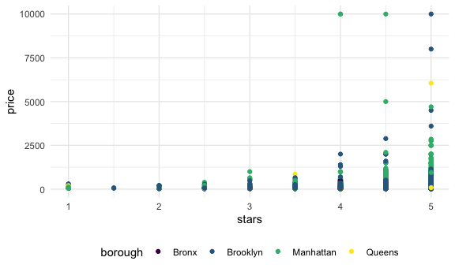
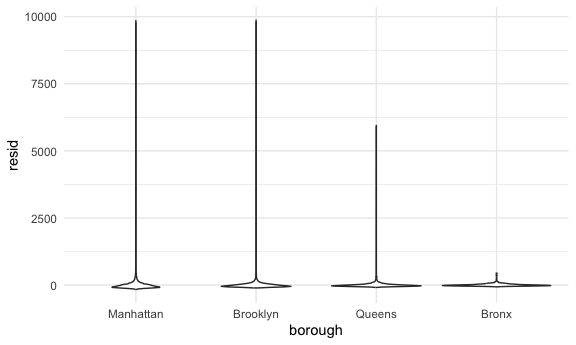

Linear models
================
2024-10-30

## Getting Started!

In general, remember linear regression (lm) is for continuous variables
and logistic regression (generalized linear model (glm)) is for
categorial variables.

So I put a couple of packages into my library so I can do my work and
the functions I want will work. The knitr used to specify information
about graphics. I also used the theme_set to tell the code to make plots
black and white and where to put the legend, respectively. Viridis is a
color scheme and I told ggplot to use that palette.

## Import Data

So we open this data set about NYC AirBnBs. You can always view the file
first using `view(nyc_airbnb)`. We changed the rating from a scale of 10
to 1-5 by dividing each number in half. We renamed a column borough to
neighborhood gorup. We removed Staten Island from borough column, and
then we only output price, stars, borough, neighborhood and room type
from the listed columns( the original doc had info about latitude and
longitude etc.– from here: <https://p8105.com/dataset_airbnb.html>)

``` r
data("nyc_airbnb")

nyc_airbnb = 
  nyc_airbnb |> 
  mutate(stars = review_scores_location / 2) |> 
  rename(
    borough = neighbourhood_group,
    neighborhood = neighbourhood) |> 
  filter(borough != "Staten Island") |> 
  select(price, stars, borough, neighborhood, room_type)

nyc_airbnb
```

    ## # A tibble: 40,492 × 5
    ##    price stars borough neighborhood room_type      
    ##    <dbl> <dbl> <chr>   <chr>        <chr>          
    ##  1    99   5   Bronx   City Island  Private room   
    ##  2   200  NA   Bronx   City Island  Private room   
    ##  3   300  NA   Bronx   City Island  Entire home/apt
    ##  4   125   5   Bronx   City Island  Entire home/apt
    ##  5    69   5   Bronx   City Island  Private room   
    ##  6   125   5   Bronx   City Island  Entire home/apt
    ##  7    85   5   Bronx   City Island  Entire home/apt
    ##  8    39   4.5 Bronx   Allerton     Private room   
    ##  9    95   5   Bronx   Allerton     Entire home/apt
    ## 10   125   4.5 Bronx   Allerton     Entire home/apt
    ## # ℹ 40,482 more rows

## Fit a model

Good! so now that we have our data set and the variables that matter, we
can create a model for the variables of interest. Here I will create a
model that considers how price relates to the rating and the borough
where the airbnb is located.

``` r
nyc_airbnb %>% 
  ggplot(aes( x= stars, y= price, color = borough)) +
  geom_point()
```

    ## Warning: Removed 9962 rows containing missing values or values outside the scale range
    ## (`geom_point()`).



Ok so no we know what the data looks like. We tell R to get the linear
model equation, since the ratings, price etc are all continuous
variables. We can set that function equal to fit.Note! The borough
options are Bronx, Brooklyn, Manhattan, Queens, and I think it might be
because Bronx is entered first, OR it could be alphabetical order, but
the regression is comparing all other boroughs to Bronx.

``` r
fit = lm(price ~ stars + borough, data = nyc_airbnb)
fit
```

    ## 
    ## Call:
    ## lm(formula = price ~ stars + borough, data = nyc_airbnb)
    ## 
    ## Coefficients:
    ##      (Intercept)             stars   boroughBrooklyn  boroughManhattan  
    ##           -70.41             31.99             40.50             90.25  
    ##    boroughQueens  
    ##            13.21

Then we can also run the summary function to get more info like degrees
of freedom. The F statistic also tells us about the overall goodness of
fit.

``` r
summary(fit)
```

    ## 
    ## Call:
    ## lm(formula = price ~ stars + borough, data = nyc_airbnb)
    ## 
    ## Residuals:
    ##    Min     1Q Median     3Q    Max 
    ## -169.8  -64.0  -29.0   20.2 9870.0 
    ## 
    ## Coefficients:
    ##                  Estimate Std. Error t value Pr(>|t|)    
    ## (Intercept)       -70.414     14.021  -5.022 5.14e-07 ***
    ## stars              31.990      2.527  12.657  < 2e-16 ***
    ## boroughBrooklyn    40.500      8.559   4.732 2.23e-06 ***
    ## boroughManhattan   90.254      8.567  10.534  < 2e-16 ***
    ## boroughQueens      13.206      9.065   1.457    0.145    
    ## ---
    ## Signif. codes:  0 '***' 0.001 '**' 0.01 '*' 0.05 '.' 0.1 ' ' 1
    ## 
    ## Residual standard error: 181.5 on 30525 degrees of freedom
    ##   (9962 observations deleted due to missingness)
    ## Multiple R-squared:  0.03423,    Adjusted R-squared:  0.03411 
    ## F-statistic: 270.5 on 4 and 30525 DF,  p-value: < 2.2e-16

I can also pull out only the coefficient from the summary function

``` r
summary(fit)$coef
```

    ##                   Estimate Std. Error   t value     Pr(>|t|)
    ## (Intercept)      -70.41446  14.020697 -5.022180 5.137589e-07
    ## stars             31.98989   2.527500 12.656733 1.269392e-36
    ## boroughBrooklyn   40.50030   8.558724  4.732049 2.232595e-06
    ## boroughManhattan  90.25393   8.567490 10.534465 6.638618e-26
    ## boroughQueens     13.20617   9.064879  1.456850 1.451682e-01

You can also use the broom package to get a more condensed description.
I can see the p value for each variable. We know that the regression is
using Bronx as a standard and comparing the other values to this. Thus,
what the coefficient estimate means is that staying in brooklyn is 40
dollars more expensive relative to the bronx, manhattan is 90 etc. ALSO
notice this tells you that queens is not significantly influencing the
price– its p value is 0.145!

``` r
broom::tidy(fit)
```

    ## # A tibble: 5 × 5
    ##   term             estimate std.error statistic  p.value
    ##   <chr>               <dbl>     <dbl>     <dbl>    <dbl>
    ## 1 (Intercept)         -70.4     14.0      -5.02 5.14e- 7
    ## 2 stars                32.0      2.53     12.7  1.27e-36
    ## 3 boroughBrooklyn      40.5      8.56      4.73 2.23e- 6
    ## 4 boroughManhattan     90.3      8.57     10.5  6.64e-26
    ## 5 boroughQueens        13.2      9.06      1.46 1.45e- 1

Now usually, people are only interested in the estimate and p value—
there is a way to put that out directly. I’m telling it to only select
the 2 columns I care about; then I’m telling it that when it looks in
the term column above and sees something that starts (^) with borough,
capitalize it, add a colon and add some space before the next character
appears.

``` r
broom::tidy(fit) %>% 
  select(term, estimate, p.value) %>% 
  mutate(term = str_replace(term, "^borough", "Borough: "))
```

    ## # A tibble: 5 × 3
    ##   term               estimate  p.value
    ##   <chr>                 <dbl>    <dbl>
    ## 1 (Intercept)           -70.4 5.14e- 7
    ## 2 stars                  32.0 1.27e-36
    ## 3 Borough: Brooklyn      40.5 2.23e- 6
    ## 4 Borough: Manhattan     90.3 6.64e-26
    ## 5 Borough: Queens        13.2 1.45e- 1

Then if we wanted to see this in an actual table, we can use the
`kable()` function that’s used in r markdown files. Remember the knitr
function is about displaying data. I can display the entire estimate and
P values, or I can say hey I’m only interested in the first 3 decimals
for both the estimate and p.value.

``` r
broom::tidy(fit) %>% 
  select(term, estimate, p.value) %>% 
  mutate(term = str_replace(term, "^borough", "Borough: ")) %>% 
knitr::kable(digits =3)
```

| term               | estimate | p.value |
|:-------------------|---------:|--------:|
| (Intercept)        |  -70.414 |   0.000 |
| stars              |   31.990 |   0.000 |
| Borough: Brooklyn  |   40.500 |   0.000 |
| Borough: Manhattan |   90.254 |   0.000 |
| Borough: Queens    |   13.206 |   0.145 |

Remember the `factor` function? Factor takes a string and attaches a
numeric value to it based on its position.

## How to change the reference category for your covariates!

Recall, I mentioned that the Bronx was automatically set as the
reference category. And that’s because the linear model by default,
treats the variables not as characters but factors, meaning it takes a
character and attaches a numeric value to it based on its position. So
it uses whatever is first as the reference.

Well! I can decide which variable should be the reference.

## First, Let’s say I want the reference column to be the most frequent borough

Here I take the nyc_airbnb modified data set from above and tell it to
organize the borough column by which borough is more frequent, and also
to reorder the room type by which is more frequent. So that the most
frequent borough appears first. And that’s what we see in the plot
below.

``` r
nyc_airbnb = 
nyc_airbnb %>% 
  mutate(
    borough = fct_infreq(borough),
    room_type = fct_infreq(room_type))
```

Now let’s see what it did to the data using the plot

``` r
nyc_airbnb %>% 
  ggplot(aes( x= stars, y= price, color = borough)) +
  geom_point()
```

    ## Warning: Removed 9962 rows containing missing values or values outside the scale range
    ## (`geom_point()`).


Now I rereun the regression.

I’ve already defined how borough should be analyzed. So note code
earlier in this segment must be run prior to this for it to work. See
now I have Bronx listed as a variable, and as expected, Bronx will be 90
dollars cheaper relative to Manhattan (the opposite of what we saw
above).

``` r
fit = lm(price ~ stars + borough, data = nyc_airbnb)

broom::tidy(fit)
```

    ## # A tibble: 5 × 5
    ##   term            estimate std.error statistic   p.value
    ##   <chr>              <dbl>     <dbl>     <dbl>     <dbl>
    ## 1 (Intercept)         19.8     12.2       1.63 1.04e-  1
    ## 2 stars               32.0      2.53     12.7  1.27e- 36
    ## 3 boroughBrooklyn    -49.8      2.23    -22.3  6.32e-109
    ## 4 boroughQueens      -77.0      3.73    -20.7  2.58e- 94
    ## 5 boroughBronx       -90.3      8.57    -10.5  6.64e- 26

## Diagnostics: starting with looking at residuals.

I use the `add_residuals` function in the modelr package to add a column
of the residuals to my condensed data frame, fit. The residual tells you
the difference between your value of interest (let’s say price) and
where it is relative to what your model would predict. So it shows that
the 99\$ private room in the Bronx is about 9 dollars more expensive
than my model predicts.

It’s good to look at residuals because that gives us an idea as to how
well the model fits the data and if there are outliers. The taller the
line, the more outliers there are.

``` r
nyc_airbnb %>% 
  modelr::add_residuals(fit) %>% 
  ggplot(aes(x = borough, y = resid)) + geom_violin()
```

    ## Warning: Removed 9962 rows containing non-finite outside the scale range
    ## (`stat_ydensity()`).


